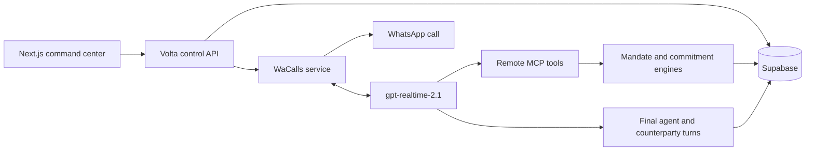

# Volta

Volta turns logistics phone conversations into verified operational commitments while enforcing a human-authored mandate.

## Stack

- Next.js 16 / TypeScript / Tailwind CSS
- OpenAI Realtime `gpt-realtime-2.1` with final input/output transcription events
- WaCalls / WhatsApp Web voice transport with bidirectional 16 kHz PCM and paced playback
- Stateless MCP tool endpoint for policy-controlled actions
- Deterministic mandate, market-ranking and commitment engines
- Supabase Postgres snapshot persistence, append-only audit events, Storage and RLS

Live command center: [volta-hackathon.vercel.app](https://volta-hackathon.vercel.app)

## Architecture



## Local run

1. Copy `.env.example` to `.env.local` and fill the non-secret configuration. Keep secrets out of Git.
2. Set `VOLTA_DEMO_MODE=true` to run the UI flow with clearly labelled simulated calls, or configure WaCalls for real consented WhatsApp calls.
3. Run `pnpm dev` and enter the configured `DEMO_ACCESS_CODE`. In development, the fallback code is `volta`.

The OpenAI key must be supplied through `OPENAI_API_KEY`. The ignored `Sem Título 14.txt` file is never read or bundled by the application.

## WhatsApp voice setup

1. Apply `supabase/migrations/202608290001_volta_core.sql`.
2. Build the service with `pnpm wacalls:build` and expose it behind a persistent HTTPS origin.
3. Set `VOLTA_VOICE_TRANSPORT=whatsapp`, `WACALLS_BASE_URL`, matching API/relay secrets and an exact `WACALLS_ALLOWED_PHONES` consent allowlist.
4. Start the service, open the command center and scan its QR from WhatsApp → Linked devices.
5. Add all variables from `.env.example` to Vercel. `APP_BASE_URL` must be the public HTTPS origin.

WaCalls uses an unofficial WhatsApp Web transport. Use a dedicated account, explicit participant consent and the exact phone allowlist. Twilio routes remain in the repository as an optional fallback.

## Authority and decisions

- Realtime transcription is evidence/guidance; it never grants authority.
- MCP tools submit structured facts to the backend.
- The mandate engine decides offer eligibility, corrections and unauthorized changes.
- The market engine selects only among eligible offers.
- Every final transcript turn and operational decision is persisted, correlated to the call and shown in the UI.
- A commitment still requires explicit confirmation, written recap and linked evidence.

## Verification

```bash
pnpm check
pnpm exec playwright install chromium
pnpm test:e2e
```

The UI never labels an outcome committed until explicit verbal confirmation, an SMS recap and timestamped audio evidence all exist.
