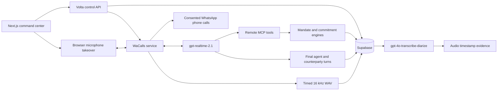

# Pact

Pact turns logistics phone conversations into verified operational commitments while enforcing a human-authored mandate. **Pact** is the product; **Volta** is the agent that identifies itself on the call, which is the name that appears in transcripts and in the canonical recap.

## Stack

- Next.js 16 / TypeScript / Tailwind CSS
- OpenAI Realtime `gpt-realtime-2.1` with final input/output transcription events
- Telnyx PSTN transport: TeXML originates the leg and hands the media to the OpenAI Realtime SIP endpoint
- WaCalls / WhatsApp Web voice transport with bidirectional 16 kHz PCM and paced playback
- Azure VPS with Caddy TLS, persistent WhatsApp session and constrained WebRTC UDP media
- Stateless MCP tool endpoint for policy-controlled actions
- Deterministic mandate, market-ranking and commitment engines
- Supabase Postgres snapshot persistence, append-only audit rows, private recording Storage and RLS

Live command center: [volta-hackathon.vercel.app](https://volta-hackathon.vercel.app)
Demo access token: volta-2041-64d508

## Architecture



## Local run

1. Copy `.env.example` to `.env.local` and fill the non-secret configuration. Keep secrets out of Git.
2. Set `VOLTA_DEMO_MODE=true` to run the UI flow with clearly labelled simulated calls, or configure WaCalls for real consented WhatsApp calls.
3. Run `pnpm dev` and enter the configured `DEMO_ACCESS_CODE`. In development, the fallback code is `volta`.

The OpenAI key must be supplied through `OPENAI_API_KEY`. The ignored `Sem Título 14.txt` file is never read or bundled by the application.

## WhatsApp voice setup

1. Apply `supabase/migrations/202608290001_volta_core.sql`.
2. Build the service with `pnpm wacalls:build` and expose it behind a persistent HTTPS origin. The repeatable Azure layout is documented in [`deploy/azure`](deploy/azure/README.md).
3. Set `VOLTA_VOICE_TRANSPORT=whatsapp`, `WACALLS_BASE_URL`, matching API/relay secrets and an exact `WACALLS_ALLOWED_PHONES` consent allowlist.
4. Start the service, open the command center and scan its QR from WhatsApp → Linked devices.
5. Add all variables from `.env.example` to Vercel. `APP_BASE_URL` must be the public HTTPS origin.

WaCalls uses an unofficial WhatsApp Web transport. Use a dedicated account, explicit participant consent and the exact phone allowlist. It is not PSTN. `VOLTA_VOICE_TRANSPORT` selects `telnyx`, `whatsapp` or `twilio` behind one dial interface; ADR-009 records why both transports exist.

## Authority and decisions

- Realtime transcription is evidence/guidance; it never grants authority.
- MCP tools submit structured facts to the backend.
- The mandate engine decides offer eligibility, corrections and unauthorized changes.
- The market engine selects only among eligible offers.
- Every final transcript turn and operational decision is persisted, correlated to the call and shown in the UI.
- A commitment still requires explicit confirmation, written recap and linked evidence.
- The written recap leaves by every configured channel — the text transport, and email when the carrier has an address. One delivery advances the commitment; none leaves it short and says so.
- The number a handoff dials belongs to the briefing, not the environment: whoever is on duty can change it without a deploy. Leave it empty and the escalation stays in the dashboard.
- Inbound calls from allowlisted carriers are correlated automatically; an unauthorized change opens a live browser-microphone takeover without ending the call.

### What enforces each limit

The operator sets seven limits in the briefing. None of them is a request to the
model — each is checked server-side, on every offer or change the agent submits.

| Limit | Enforced by | Refusal |
|---|---|---|
| `currency` | `evaluateOffer` | `currency_mismatch` |
| `maximumRate` | `evaluateOffer`, `report_operational_change` | `rate_above_mandate` |
| pickup day | `evaluateOffer` | `pickup_day_outside_mandate` |
| pickup window | `evaluateOffer` | `pickup_time_outside_window` |
| `acceptAccessorials` | `evaluateOffer` | `unsupported_accessorial` |
| `maximumCounters` | `evaluateOffer`, per carrier revision count | `counter_limit_exhausted` |
| `negotiateRate` | `counterBudget` — withholding it allows the opening quote only | `rate_negotiation_not_authorized` |
| `changePickupDay` | `report_operational_change` | `pickup_day_change_not_authorized` |

`targetRate` is guidance the agent negotiates toward; the ceiling is what binds.
An offer that restates the standing terms returns the existing revision, so a
retried tool call cannot spend a counter.

### What counts as a yes

A booking advances only on an answer that opens on an affirmative, carries no
qualifier and stays short. The vocabulary is wide on purpose — `sí señor` and
`correcto, procedemos` are how dispatchers actually speak, and refusing them
reads as a broken agent. The shape stays narrow: `sí, pero cambia el horario`
and `sí, mi jefe ya aprobó diez mil quinientos` do not get through. The same
matcher locates the confirming segment inside the recording, so what the engine
accepts is also what the evidence has to show.

## Design system

Tokens live at the top of `app/globals.css`: a type ramp, an eight-step space
scale, motion durations and easing, elevation, and a focus ring. Nothing in the
stylesheet sets a raw size or gap any more.

The type floor is set by where this runs. It is read off a projector by a room,
not off a laptop by its author, so the smallest text is 10px and most labels sit
at 11.5px — before, forty-nine declarations were 10px or under and two were 6px.
Every text on the dashboard clears WCAG AA against its own background, keyboard
focus is visible because the demo is driven live, and `prefers-reduced-motion`
is honoured.

## Verification

```bash
pnpm check
pnpm exec playwright install chromium
pnpm test:e2e
```

71 unit tests cover the mandate engine, the counter budget end to end through the store, the commitment state machine and thirty phrases a dispatcher might actually say.

The UI never labels an outcome committed until explicit verbal confirmation, a written recap and timestamped audio evidence all exist.

## Hackathon deliverables

- [Presentation](docs/PRESENTATION.md)
- [Live demo script](docs/DEMO_SCRIPT.md)
- [Architecture diagram and trust boundaries](docs/ARCHITECTURE.md)
- [Decision log](docs/DECISIONS.md)
- [Public production command center](https://volta-hackathon.vercel.app)

## Honest runtime limits

- Inbound over Telnyx is unrestricted: a call from any phone, in any country, reaches the agent under the mandate.
- Outbound over Telnyx currently reaches US, MX, CA and ES. Voice termination to Brazil needs Telnyx account verification level 2, which is a manual review; the code needs no change when it clears.
- WhatsApp calls are real phone calls to consented E.164 accounts, but the transport is not PSTN.
- Three-device parallel QA requires three consented numbers in `WACALLS_ALLOWED_PHONES`; automated tests never dial real people.
- Production WaCalls runs persistently on Azure; availability still depends on the VPS, Caddy and the unofficial WhatsApp Web session staying healthy.
- A simulated booking stops at `RECAP_SENT`. Without a recording there is no audio evidence, and the ledger never claims otherwise.
