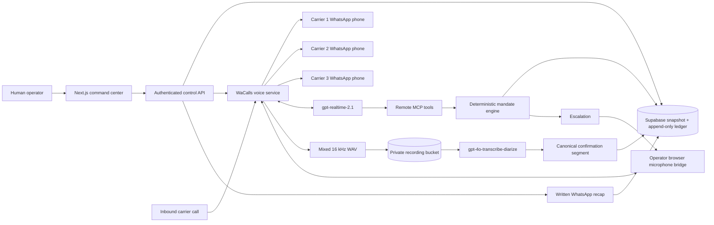
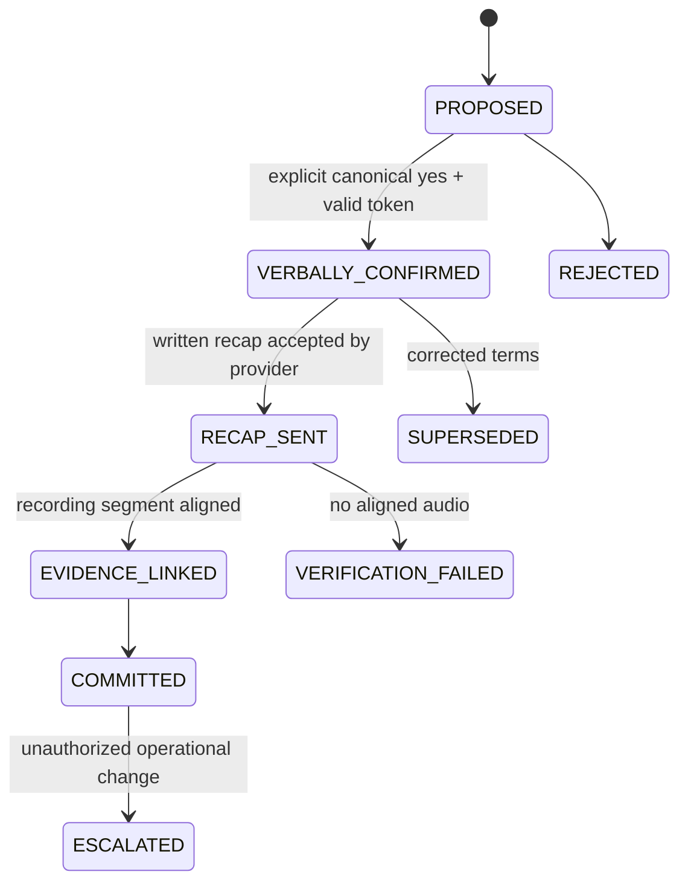

# Volta architecture

## Trust boundary

The model may listen, speak and submit structured observations. It cannot modify the mandate. Every offer, correction, operational change and booking confirmation is re-evaluated server-side. Ambiguity reduces autonomy.

## Commitment gate

## Runtime ownership

- Vercel owns the command center, authenticated APIs, MCP server and webhooks.
- Supabase owns current operation state, durable jobs, private recordings and append-only audit rows.
- WaCalls owns WhatsApp signaling, bidirectional PCM, Realtime bridging, barge-in and browser takeover.
- The production WaCalls process runs on an Azure VPS behind Caddy; SQLite preserves the paired device and Azure NSG exposes only HTTPS plus the constrained WebRTC UDP range.
- OpenAI Realtime owns the live Spanish conversation; the deterministic backend owns authority.
