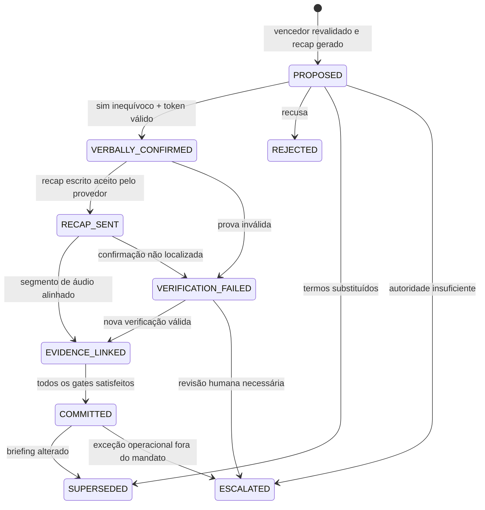

# Diagrama completo de features — Pact / Volta

Este mapa representa as features presentes no código do repositório em 30/08/2026. Ele separa o que o produto faz, os motores determinísticos que autorizam cada ação e os serviços externos necessários para a execução ao vivo.

## 1. Mapa mestre do produto

```mermaid
flowchart TB
  OP["Operador humano"]
  CARRIER["Transportadora, dispatcher ou avaliador"]

  subgraph UI["Command center — Next.js"]
    AUTH["Login por código<br/>sessão segura e logout"]
    BRIEF["Briefing editável<br/>referência, cliente, carga, rota,<br/>data, janela e telefone de handoff"]
    MANDATE_UI["Mandato humano<br/>meta, teto, negociação, acessórios,<br/>troca de dia e limite de contrapropostas"]
    CARRIERS_UI["Transportadoras<br/>nome, dispatcher, telefone E.164<br/>e email opcional de recap"]
    ACTIONS["Ações operacionais<br/>delegar, salvar, nova operação,<br/>reservar, renegociar e simular exceção"]
    WA_UI["Conexão WhatsApp<br/>status, pareamento e QR Code"]
    MARKET_UI["Comparação de mercado<br/>ranking, oferta, janela e decisão"]
    INTEL_UI["Inteligência da chamada<br/>transcrição final, decisões e call brief"]
    PROOF_UI["Prova do compromisso<br/>ledger, status e reprodução do áudio"]
    AUDIT_UI["Audit stream<br/>eventos, severidade e horário"]
    ESC_UI["Escalação ao vivo<br/>conflito, mudança pedida e takeover"]
  end

  subgraph CONTROL["API e orquestração Pact"]
    CONFIG["Salvar e validar briefing"]
    SCAN["Market scan<br/>3 cotações em paralelo"]
    SINGLE["Chamada de teste<br/>para uma transportadora"]
    SETTLE["Fechamento automático do mercado<br/>espera todas as cotações"]
    BOOK["Booking automático ou manual<br/>liga para o vencedor vigente"]
    RENEG["Renegociação<br/>aposenta o acordo e religa"]
    INBOUND["Entrada de chamadas<br/>correlação conhecida ou caller desconhecido"]
    CALLS["Ciclo das chamadas<br/>QUOTE, BOOKING, RENEGOTIATION,<br/>INBOUND e HANDOFF"]
  end

  subgraph VOICE["Camada de voz selecionável"]
    SELECTOR{"VOLTA_VOICE_TRANSPORT"}

    subgraph TELNYX["Telnyx — PSTN principal"]
      TX_OUT["Outbound TeXML"]
      TX_IN["Inbound de qualquer telefone"]
      TX_SIP["SIP direto para OpenAI<br/>headers de correlação"]
      TX_REC["Gravação dual-channel"]
      TX_SMS["Recap por SMS"]
      TX_REFER["Transferência SIP REFER<br/>para operador"]
    end

    subgraph WACALLS["WaCalls — WhatsApp fallback"]
      WA_PAIR["Sessão persistente<br/>pairing e allowlist"]
      WA_CALL["Chamadas outbound e inbound"]
      WA_MEDIA["Áudio PCM bidirecional<br/>pacing, resample e barge-in"]
      WA_WAV["WAV mono com timeline"]
      WA_TEXT["Recap por WhatsApp"]
      WA_HANDOFF["Takeover WebRTC<br/>microfone do navegador"]
    end

    subgraph TWILIO["Twilio — compatibilidade/fallback"]
      TW_CALL["Conference ou Media Streams"]
      TW_RELAY["Relay WebSocket em Cloudflare"]
      TW_REC["Recording callback"]
      TW_SMS["Recap por mensagem"]
      TW_HUMAN["Perna humana na conferência"]
    end
  end

  subgraph AGENT["Volta — agente de voz"]
    RT["OpenAI Realtime<br/>gpt-realtime-2.1, voz marin"]
    AUDIO_AI["VAD, redução de ruído,<br/>interrupção e turnos curtos em espanhol"]
    TRANSCRIPT["Transcrição final<br/>agente e contraparte"]
    MCP["MCP stateless autenticado"]
    TOOLS["6 ferramentas estreitas<br/>contexto, oferta, stage, confirmação,<br/>mudança operacional e handoff"]
  end

  subgraph AUTHORITY["Autoridade determinística — servidor"]
    POLICY["Motor de mandato<br/>moeda, teto, dia, janela, acessórios,<br/>negociação e budget de counters"]
    DEDUPE["Revisões e idempotência<br/>restatement não gasta contraproposta"]
    RANK["Ranking de mercado<br/>menor preço elegível, horário e desempate"]
    CONFIRM["Confirmação canônica<br/>sim inequívoco, sem condição, token válido"]
    CHANGE["Mudança operacional<br/>observa, bloqueia ou escala"]
  end

  subgraph COMMITMENT["Compromisso verificável"]
    STAGE["Recap canônico proposto"]
    VERBAL["Confirmação verbal"]
    RECAP["Recap escrito entregue"]
    EMAIL["Recap adicional por email<br/>via Resend"]
    RECORDING["Gravação privada"]
    JOB["Job durável com retry e dedupe"]
    DIARIZE["Diarização<br/>gpt-4o-transcribe-diarize"]
    SEGMENT["Segmento afirmativo<br/>timestamp + speaker + texto"]
    VERIFY_GATE{"Recap escrito +<br/>evidência de áudio?"}
    COMMITTED["COMMITTED<br/>somente recap + evidência"]
  end

  subgraph HANDOFF["Exceção e continuidade humana"]
    BLOCK["Limite de autoridade atingido"]
    ESC["Escalação OPEN → DIALING<br/>→ CONNECTED → RESOLVED"]
    HUMAN["Operador assume<br/>sem encerrar a conversa"]
  end

  subgraph DATA["Dados, segurança e operação"]
    SNAPSHOT["Snapshot da operação<br/>concorrência otimista + fila de escrita"]
    LEDGER["Ledger append-only<br/>eventos e decisões correlacionadas"]
    SUPABASE[("Supabase Postgres")]
    STORAGE[("Storage privado de gravações")]
    MEMORY["Store em memória<br/>modo demo"]
    SECURITY["Controles<br/>cookie JWT, rate limit, assinatura de webhook,<br/>shared secrets, allowlist e RLS"]
    DEPLOY["Runtime<br/>Vercel + Supabase + Azure/Caddy/systemd<br/>+ Cloudflare Worker quando Twilio"]
    TESTS["Qualidade<br/>unitários, concorrência, contratos,<br/>Go, TypeScript, build e Playwright E2E"]
  end

  OP --> AUTH --> BRIEF
  BRIEF --> MANDATE_UI --> CARRIERS_UI --> ACTIONS
  OP --> WA_UI
  OP --> MARKET_UI
  OP --> INTEL_UI
  OP --> PROOF_UI
  OP --> AUDIT_UI
  OP --> ESC_UI

  BRIEF --> CONFIG
  ACTIONS --> CONFIG
  ACTIONS --> SCAN
  ACTIONS --> SINGLE
  ACTIONS --> BOOK
  ACTIONS --> RENEG
  ACTIONS --> INBOUND
  SCAN --> CALLS
  SINGLE --> CALLS
  CALLS --> SETTLE --> BOOK
  RENEG --> CALLS
  CARRIER --> INBOUND --> CALLS

  CALLS --> SELECTOR
  SELECTOR --> TX_OUT --> TX_SIP
  CARRIER --> TX_IN --> TX_SIP
  TX_OUT --> TX_REC
  TX_IN --> TX_REC
  SELECTOR --> WA_CALL --> WA_MEDIA
  WA_PAIR --> WA_CALL
  WA_MEDIA --> WA_WAV
  SELECTOR --> TW_CALL --> TW_RELAY
  TW_CALL --> TW_REC
  TX_SIP --> RT
  WA_MEDIA <--> RT
  TW_RELAY <--> RT

  RT --> AUDIO_AI
  RT --> TRANSCRIPT
  RT --> MCP --> TOOLS
  TOOLS --> POLICY
  TOOLS --> CONFIRM
  TOOLS --> CHANGE
  POLICY --> DEDUPE --> RANK
  POLICY --> BLOCK
  CHANGE --> BLOCK

  RANK --> STAGE --> CONFIRM --> VERBAL
  VERBAL --> RECAP
  RECAP --> TX_SMS
  RECAP --> WA_TEXT
  RECAP --> TW_SMS
  RECAP --> EMAIL
  TX_REC --> RECORDING
  WA_WAV --> RECORDING
  TW_REC --> RECORDING
  RECORDING --> STORAGE --> JOB --> DIARIZE --> SEGMENT --> VERIFY_GATE
  RECAP --> VERIFY_GATE --> COMMITTED

  BLOCK --> ESC --> HUMAN
  ESC --> TX_REFER --> HUMAN
  ESC --> WA_HANDOFF --> HUMAN
  ESC --> TW_HUMAN --> HUMAN
  HUMAN --> CARRIER

  CONFIG --> SNAPSHOT
  CALLS --> SNAPSHOT
  TRANSCRIPT --> SNAPSHOT
  POLICY --> LEDGER
  CONFIRM --> LEDGER
  CHANGE --> LEDGER
  SNAPSHOT --> SUPABASE
  LEDGER --> SUPABASE
  SNAPSHOT -. "demo" .-> MEMORY
  SUPABASE --> MARKET_UI
  SUPABASE --> INTEL_UI
  SUPABASE --> PROOF_UI
  SUPABASE --> AUDIT_UI
  SUPABASE --> ESC_UI
  SECURITY --> AUTH
  SECURITY --> CONFIG
  SECURITY --> MCP
  SECURITY --> SELECTOR
  DEPLOY --> CONFIG
  DEPLOY --> SELECTOR
  TESTS --> CONFIG
  TESTS --> SELECTOR

  classDef external fill:#fff7ed,stroke:#f97316,color:#7c2d12,stroke-dasharray:6 4;
  classDef demo fill:#f8fafc,stroke:#64748b,color:#334155,stroke-dasharray:2 4;
  classDef core fill:#eff6ff,stroke:#2563eb,color:#172554;
  class TX_OUT,TX_IN,TX_SIP,TX_REC,TX_SMS,TX_REFER,WA_PAIR,WA_CALL,WA_MEDIA,WA_WAV,WA_TEXT,WA_HANDOFF,TW_CALL,TW_RELAY,TW_REC,TW_SMS,TW_HUMAN,RT,DIARIZE,EMAIL,SUPABASE,STORAGE,DEPLOY external;
  class MEMORY,TESTS demo;
  class POLICY,DEDUPE,RANK,CONFIRM,CHANGE,STAGE,VERBAL,RECAP,SEGMENT,COMMITTED,BLOCK,ESC core;
```

**Leitura da legenda:** azul identifica os motores e gates centrais implementados pelo Pact; laranja tracejado identifica integrações cujo funcionamento ao vivo depende de credenciais, conta, número, rede e infraestrutura externas; cinza pontilhado identifica suporte de demo e validação.

## 2. Fluxo operacional ponta a ponta

```mermaid
flowchart LR
  DRAFT["DRAFT<br/>briefing e mandato"] -->|"Delegar operação"| SCANNING["SCANNING<br/>cotações paralelas"]
  SCANNING -->|"Oferta recebida"| POLICY{"Dentro do mandato?"}
  POLICY -->|"não"| BLOCKED["Oferta bloqueada<br/>reason codes no ledger"]
  POLICY -->|"sim"| ELIGIBLE["Oferta elegível<br/>revisão vigente"]
  BLOCKED --> SETTLED{"Todas as chamadas<br/>terminaram?"}
  ELIGIBLE --> RANK["Ranking determinístico"] --> SETTLED
  SETTLED -->|"não"| SCANNING
  SETTLED -->|"sim, sem elegível"| ESCALATE["AT_RISK<br/>handoff humano"]
  SETTLED -->|"sim, com vencedor"| QUOTED["QUOTED<br/>vencedor vigente"]
  QUOTED -->|"auto-book ou botão"| BOOKING["BOOKING<br/>ligação de fechamento"]
  BOOKING --> PROPOSED["PROPOSED<br/>recap canônico + token"]
  PROPOSED -->|"resposta ambígua"| ASK["Pedir confirmação novamente"] --> PROPOSED
  PROPOSED -->|"sim inequívoco"| VERBAL["VERBALLY_CONFIRMED"]
  VERBAL --> WRITTEN["RECAP_SENT<br/>SMS, WhatsApp ou email"]
  VERBAL --> AUDIO["Gravação → diarização<br/>→ segmento confirmado"]
  AUDIO --> EVIDENCE["EVIDENCE_LINKED"]
  WRITTEN --> GATE{"Recap e evidência<br/>existem?"}
  EVIDENCE --> GATE
  GATE -->|"sim"| DONE["COMMITTED<br/>compromisso verificável"]
  GATE -->|"não"| PENDING["Pendente ou<br/>VERIFICATION_FAILED"]
  DONE -->|"briefing mudou"| SUPER["SUPERSEDED / AT_RISK"]
  SUPER -->|"Religar mesma transportadora"| RENEG["RENEGOTIATION"] --> PROPOSED
  DONE -->|"mudança fora da autoridade"| ESCALATE
  ESCALATE --> TAKEOVER["REFER, WebRTC ou conferência"] --> HUMAN["Humano continua a chamada"]
  PENDING -. "modo demo para aqui,<br/>sem fabricar áudio" .-> WRITTEN
```

## 3. Máquina de estados do compromisso

## 4. Superfícies cobertas

| Área | Features mapeadas |
|---|---|
| Briefing | Dados da operação, rota, janela, mandato, transportadoras, email de recap e telefone de handoff |
| Mercado | Três cotações, chamada individual, contrapropostas, correções, ranking e auto-book |
| Conversa | Outbound, inbound, espanhol, barge-in, VAD, transcrição final e call brief |
| Autoridade | Validação server-side, reason codes, idempotência, revalidação e bloqueio fail-closed |
| Booking | Recap canônico, token temporário, confirmação inequívoca e entrega por SMS, WhatsApp e/ou email |
| Evidência | Gravação, Storage privado, fila, retry, diarização, timestamp e player |
| Exceções | Mudança operacional, escalação automática, REFER, WebRTC e conferência humana |
| Observabilidade | Snapshot, decisões, transcript, call brief, ledger append-only e audit stream |
| Transportes | Telnyx, WaCalls/WhatsApp e Twilio/Cloudflare sob uma interface comum |
| Segurança | Sessão, rate limit, assinatura de webhooks, segredo de relay/MCP, allowlist e RLS |
| Operação | Vercel, Supabase, Azure/Caddy/systemd, modo demo, jobs e suíte de testes |

## Limite de leitura

O diagrama confirma presença e encadeamento no código; ele não confirma que contas de telefonia, números, compliance, credenciais, VPS, sessão do WhatsApp ou rotas públicas estejam ativos neste momento. O runtime também continua deliberadamente centrado em uma operação/snapshot principal, não em uma plataforma multi-tenant completa.
